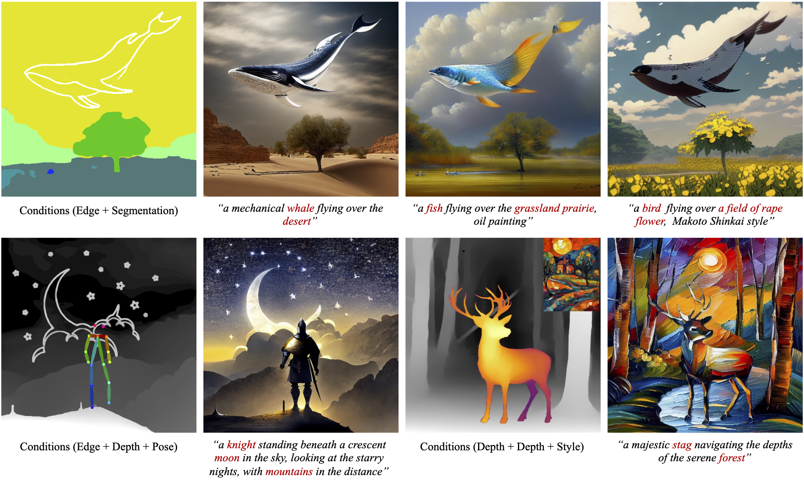
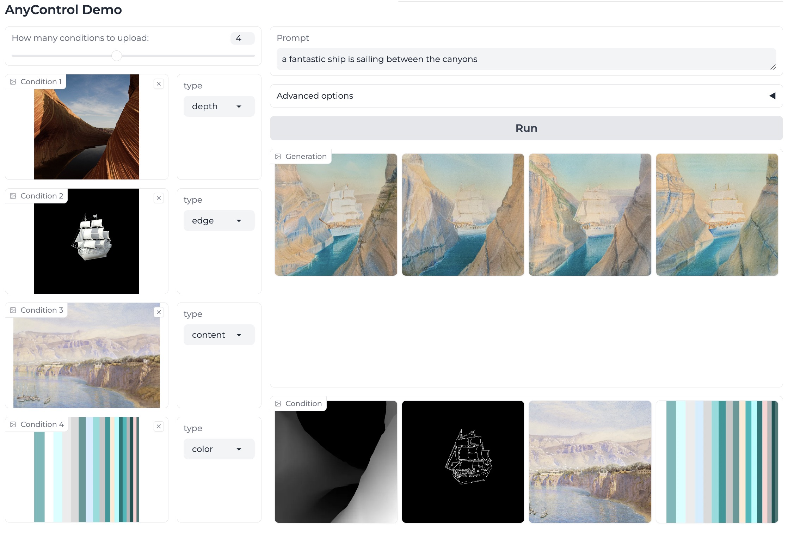

# [ECCV 2024] AnyControl: Create Your Artwork with Versatile Control on Text-to-Image Generation 
[](https://arxiv.org/abs/2406.18958)
[](https://any-control.github.io/)
[](https://huggingface.co/nowsyn/anycontrol)
<a target="_blank" href="https://huggingface.co/spaces/nowsyn/AnyControl">
  
</a>

> **AnyControl: Create Your Artwork with Versatile Control on Text-to-Image Generation**
>
> [Yanan Sun](https://scholar.google.com/citations?user=6TA1oPkAAAAJ&hl=en), Yanchen Liu, Yinhao Tang, [Wenjie Pei](https://wenjiepei.github.io/) and [Kai Chen*](https://chenkai.site/)
> 
> (\* Corresponding Author)
>
> - Presented by Shanghai AI Laboratory
> - :mailbox_with_mail: Primary contact: [Yanan Sun](https://scholar.google.com/citations?user=6TA1oPkAAAAJ&hl=en) ( now.syn@gmail.com ) 

## Highlights <a name="highlights"></a>

:star2: **AnyControl**, a controllable image synthesis framework that supports any combination of various forms of control signals. Our AnyControl enables holistic understanding of user inputs, and produces harmonious results in high quality and fidelity under versatile control signals.

:star2: AnyControl proposes a novel Multi-Control Encoder comprising alternating multi-control fusion block and multi-control alignment block to achieve comprehensive understanding of complex multi-modal user inputs. 




## What's New<a name="news"></a>

[2024/07/05] Online demo released in [HuggingFace]("https://huggingface.co/spaces/nowsyn/AnyControl").

[2024/07/03] :fire: AnyControl accepted by ECCV 2024!

[2024/07/03] COCO-UM released in [HuggingFace](https://huggingface.co/datasets/nowsyn/COCO-UM).

[2024/07/03] AnyControl models released in [HuggingFace](https://huggingface.co/nowsyn/anycontrol).

[2024/07/03] AnyControl training and inference code released.


## Table of Contents

- [Installation](#installation)
- [Inference](#inference) 
- [Training](#training)
- [Results](#results)
- [COCO-UM](#coco-um)
- [License and Citation](#license-and-citation)
- [Related Resources](#resources)

## Installation <a name="installation"></a>

```bash
# Clone the Repository
git clone https://github.com/nowsyn/AnyControl.git

# Navigate to the Repository
cd AnyControl

# Create Virtual Environment with Conda
conda create --name AnyControl python=3.10
conda activate AnyControl

# Install Dependencies
pip install -r requirements.txt

# Install detectron2
pip install git+https://github.com/facebookresearch/detectron2.git@v0.6

# Compile ms_deform_attn op
cd annotator/entityseg/mask2former/modeling/pixel_decoder/ops
sh make.sh
```

## Inference <a name="inference"></a>

1. Download `anycontrol_15.ckpt` and third-party models from [HuggingFace](https://huggingface.co/nowsyn/anycontrol).

```bash
conda install git-lfs
git lfs install

mkdir .cache
git clone https://huggingface.co/nowsyn/anycontrol .cache/anycontrol

ln -s `pwd`/.cache/anycontrol/ckpts ./ckpts
ln -s `pwd`/.cache/anycontrol/annotator/ckpts ./annotator/ckpts
```

2. Start the gradio demo.

```bash
python src/inference/gradio_demo.py
```

We give a screenshot of the gradio demo. You can set the number of conditions you prefer to use dynamically, then upload the condition images and choose the processor for each conditon. We totally provide 4 spatial condition processors including `edge`, `depth`, `seg`, and `pose`. BTW, another two global control processors `content` and `color` are provided for your information, which are not part of this work.




## Training

We recommand using 8 A100 GPUs for training. 

1. Please refer to [DATASET.md](docs/DATASET.md) to prepare datasests.
2. Start multi-gpu training.

```bash
python -m torch.distributed.launch --nproc_per_node 8 src/train/train.py \
    --config-path configs/anycontrol_local.yaml \
    --learning-rate 0.00001 \
    --batch-size 8 \
    --training-steps 90000 \
    --log-freq 500
```

## Results<a name="results"></a>


## COCO-UM<a name="coco-um"></a>
Most existing methods evaluate multi-control image synthesis on COCO-5K with totally spatio-aligned conditions. However, we argue that evaluation on well-aligned multi-control conditions cannot reflect the ability of methods to handle overlapped  multiple conditions in practical applications, given that the user provided conditions are typically collected from diverse sources which are not aligned. 

Therefore, we construct an **U**naligned **M**ulti-control benchmark based on COCO-5K, short for **COCO-UM**, for a more effective evaluation on multi-control image synthesis. 

You can access COCO-UM [here](https://huggingface.co/datasets/nowsyn/COCO-UM). 


## License and Citation <a name="license-and-citation"></a>

All assets and code are under the [license](./LICENSE) unless specified otherwise.

If this work is helpful for your research, please consider citing the following BibTeX entry.

``` bibtex
@misc{sun2024anycontrol,
  title={AnyControl: Create your artwork with versatile control on text-to-image generation},
  author={Sun, Yanan and Liu, Yanchen and Tang, Yinhao and Pei, Wenjie and Chen, Kai},
  booktitle={ECCV},
  year={2024},
}
```

## Related Resources <a name="resources"></a>

We acknowledge all the open-source contributors for the following projects to make this work possible:

- [Uni-ControlNet](https://github.com/ShihaoZhaoZSH/Uni-ControlNet) | [UniControl](https://github.com/salesforce/UniControl) | [ControlNet](https://github.com/lllyasviel/ControlNet)
